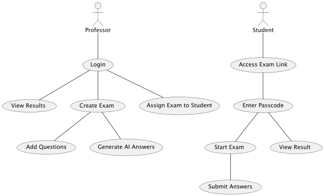
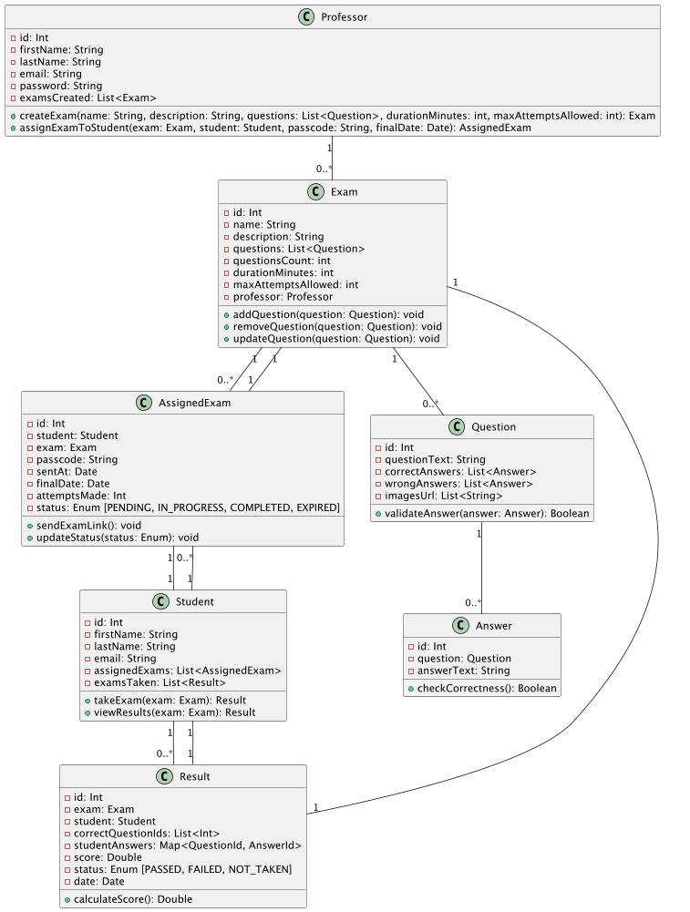
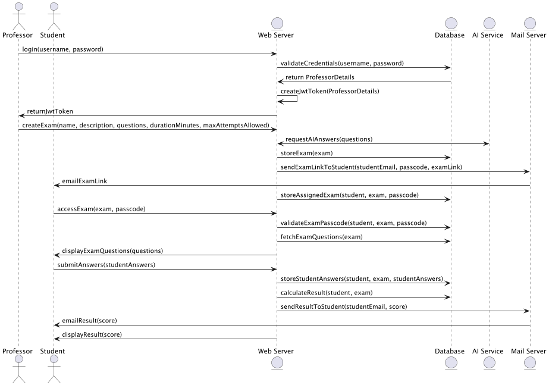
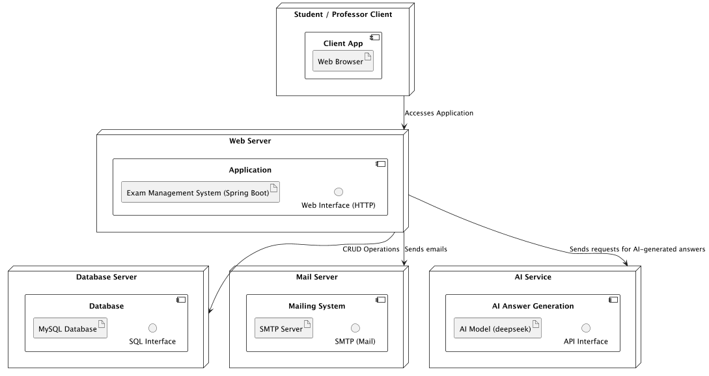

# Web-Based Exam Application

[](https://opensource.org/licenses/MIT)

A secure web application designed for creating, distributing, and taking online exams. It features an intelligent AI service that generates plausible wrong answers for multiple-choice questions (MCQs), adding a dynamic layer to exam creation. The platform also includes a complete backend system with role-specific access for professors and students, email notifications, and real-time result tracking.

## Features

### Professor Features
- 🎓 Create and manage exams with multiple question types (MCQ/Direct Answer).
- 📤 Generate unique exam links for students with expiration dates and controlled access.
- 🤖 Utilize AI-powered question generation, including plausible wrong answers for MCQs.
- 📊 Real-time result tracking and detailed analytics for student performance.
- 📧 Send bulk enrollment emails to students and manage their access to exams.

### Student Features
- 🔒 Access exams securely through time-limited links with passcodes.
- ⏱ Timer-based questions with automatic submission to ensure fairness.
- 📝 Review answers before final submission for a comprehensive exam-taking experience.
- 📩 Receive instant result notifications via email after exam completion.
- 📈 Access detailed performance breakdown and scores upon exam completion.

## Technologies

**Frontend**  


**Backend**  


**AI Service**  


**Database**  


**Deployment**  


## System Architecture

### Use Case Diagram

### Class Diagram

### Sequence Diagram

### Deployment Diagram


## Installation
### Prerequisites
- Docker
- Docker Compose
- Node.js 22.x
- Java 21
- Python 3.13

## Directory Structure
```
exams-app/
├── backend-api/           # Spring Boot application
├── frontend-website/      # Angular application 
├── ai-service/            # FastAPI service for AI question generation
├── mail-service/          # Email microservice
├── docker-compose.yml     # Main compose file
└── README.md 
```


## License
Distributed under the MIT License. See `LICENSE` for more information.

## Contact
Feel free to reach out for any questions or contributions!  
[LinkedIn](https://www.linkedin.com/in/aksaimamin)  
[Portfolio](https://aksaim.me)  
[aksaimmohamedamin@gmail.com](mailto:aksaimmohamedamin@gmail.com)
